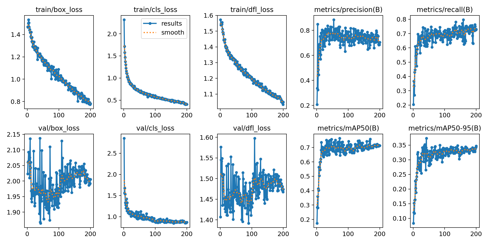

# 교통 혼잡 모니터링 시스템

이 프로젝트는 YOLOv8 기반 모델을 사용하여 CCTV 영상을 통해 교통 혼잡을 모니터링하고 분석합니다.

## 주요 기능
- 실시간 차량 감지
- 교통 상태 분석 (원활, 서행, 혼잡)
- 관심 영역(ROI) 설정 가능

## 요구 사항
- Python 3.8+
- 필요한 라이브러리:
  - Flask
  - OpenCV
  - Ultralytics (YOLOv8)
  - Numpy

## 사용 방법

1. 저장소를 클론하세요:
   ```bash
   git clone https://github.com/dlalstjd0513/traffic_congestion_monitoring-system.git
   cd traffic_congestion_monitoring-system
   ```

2. Google Drive에서 모델 파일(`last.pt`)을 다운로드한 후, 프로젝트 디렉토리에 배치하세요:
   [last.pt 다운로드](https://drive.google.com/file/d/1d7LYhLKPGwZ3rShYSOfe703X7n9PMCT_/view?usp=drive_link)

   Google Drive에서 영상 파일(`cctv4.mp4`)를 다운로드한 후, 프로젝트 디렉토리에 배치하세요:
   [cctv4.mp4 다운로드](https://drive.google.com/file/d/1d7LYhLKPGwZ3rShYSOfe703X7n9PMCT_/view?usp=drive_link)

3. Flask 서버를 실행하세요:
   ```bash
   python traffic_system.py
   ```

4. 웹 브라우저에서 다음 주소로 이동하세요:
   ```
   http://localhost:5000/video_feed
   ```

## 파일 구조
```
traffic_congestion_monitoring-system/
├── last.pt                # YOLOv8 모델 파일 (별도로 다운로드 필요)
├── cctv4.mp4              # cctv 영상 파일 (별도로 다운로드 필요)
├── traffic_system.py      # 메인 애플리케이션 파일
├── result.png             # YOLOv8 학습 결과
├── README.md              # 프로젝트 문서
└── data.yaml              # YOLOv8 학습 yaml파일
```

## 파일 정보
`last.pt` 파일은 차량 감지를 위한 사전 학습된 YOLOv8 모델을 포함합니다. 애플리케이션을 실행하기 전에 반드시 다운로드하세요.
'cctv4.mp4'파일은 브라우저에서 사용되는 영상입니다. 애플리케이션을 실행하기 전에 반드시 다운로드하세요.

## YOLOv8 모델 학습 결과

---

### 참고 사항
- YOLOv8 모델을 효율적으로 실행하려면 GPU와 같은 필수 하드웨어가 필요합니다.
- 문제가 발생하면 저장소의 이슈 탭에 문의하세요.